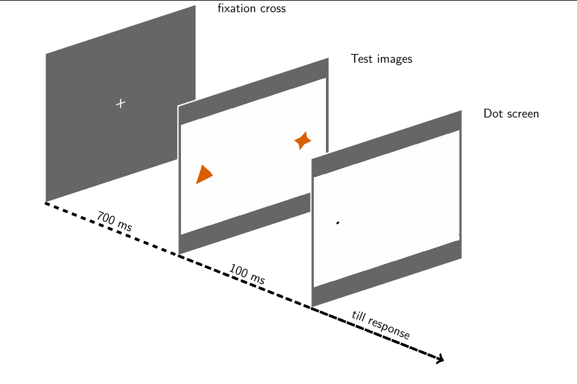

# Dot Probe task
In this paradigm the screen is split in two and two images are briefly presented on each side of the screen, after that, a dot will appears either on the left or right side of the screen and participants should indicate the position of the dot position using the keyboard.

