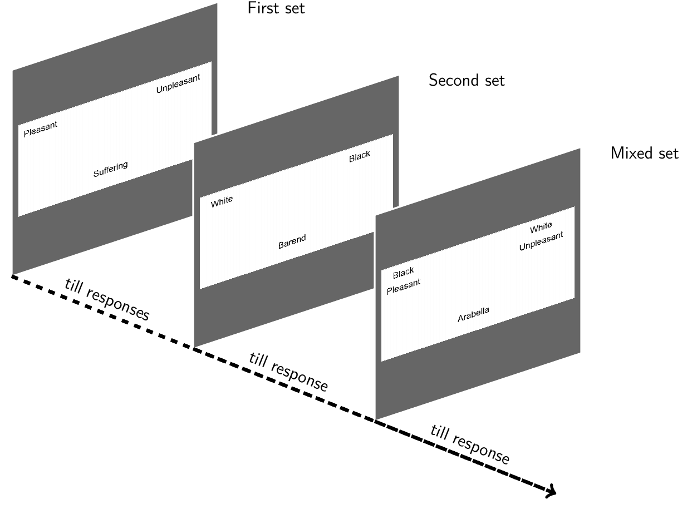

# Implicit-association test
In this paradigm a set of stimuli must be classified into two categories (forced-choice), starting with familiar positive and negative stimuli (such as emotions) and moving to other set of stimuli that can generate implicit attitudes, and finally mixing both sets.

